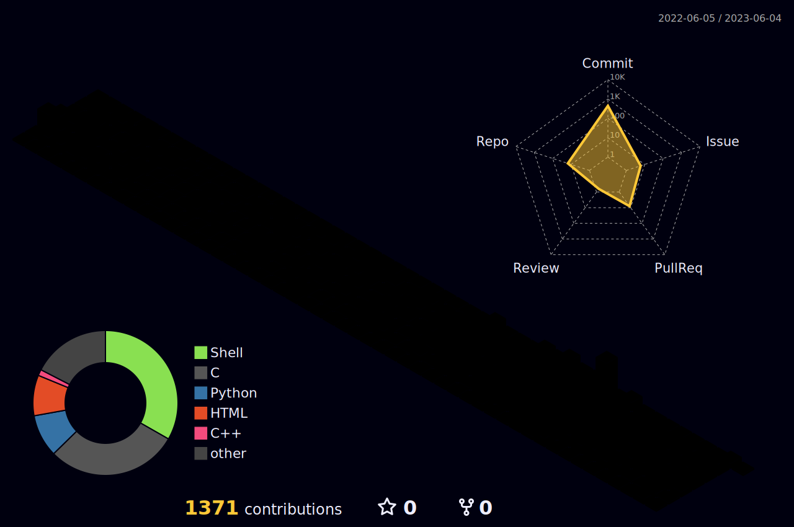

### 
[;console.log(%22Hello+World!%22);printf(%22Hello+World!%5Cn%22);%3Ch1%3EHello+World!%3C%2Fh1%3E)](https://git.io/typing-svg)

  

  <!--  -->
  

  

## About me 🧍
- (non coding)Languages:
  - 🇮🇹 Mother tongue
  - 🇬🇧 B1 (aka First)
  - 🇩🇪 Studied in middle school, currently self-teaching

- 💼 My working stack:
  - Full Stack Web Development

    

  - Mobile Development

    
    

  - Company Automation

    

- 🌱 Languages I'm currently studying

  

- 🔭 I'm interested in Game Development

  

- \\[T]/ Other nerd stuff

  
  

- ☕ Addicted to coffee

- (ノ ゜Д゜)ノ ︵ ┻━┻ I don't have a social life

<!--
  

    
    
    
  

-->

<!--  -->
